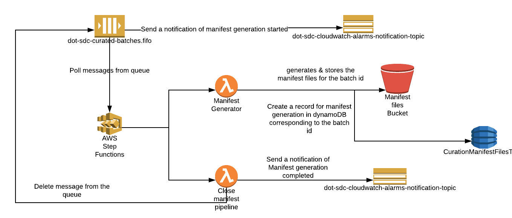

# sdc-dot-manifest-generator
This lambda function runs every 5 mins and creates a manifest file for each batch whose ReadyForProcessing is set to true.

There are two primary functions that this lambda function serves:
* **process_manifest_files** - gets all the records for a batch id, generates and uploads the manifest file in S3, creates a record corresponding to the batch id in the dynamoDB as a part of manifest generation process.
* **put_message_sqs** - puts a message for manifest generation in SQS.
* **delete_batch_id** - deletes the batch id after the completion of the manifest generation.

<a name="toc"/>

## Table of Contents

[I. Release Notes](#release-notes)

[II. Overview](#overview)

[III. Design Diagram](#design-diagram)

[IV. Getting Started](#getting-started)

[V. Unit Tests](#unit-tests)

[VI. Support](#support)

---

<a name="release-notes"/>


## [I. Release Notes](ReleaseNotes.md)
TO BE UPDATED

<a name="overview"/>

## II. Overview
A manifest file contains all the curated records per batch per datatable.
Once a manifest file is created and uploaded to S3, the details are persisted to DynamoDb table <env>-CurationManifestFilesTable with following attributes
* ManifestId - UUID
* BatchId - Batch to which the curated record belongs to
* FileStatus - open/complete depending on if the manifest is processed or not
* ManifestS3Key - S3 key of the manifest file
* TableName - Data table name like alert,jam,irregularity e.t.c
* TotalCuratedRecordsByState - Stores the number of curated records present by state as an array, which will be pushed to cloudwatch to capture custom metrics
* TotalCuratedRecordsCount - The total number of curated records present in the manifest file

Once the manifest files are created for a batch, the record is deleted from BatchesTable in dynamoDB so it will not be processed the next time manifest creation happens.

<a name="design-diagram"/>

## III. Design Diagram



<a name="getting-started"/>

## IV. Getting Started

The following instructions describe the procedure to build and deploy the lambda.

### Prerequisites
* NA 

---
### ThirdParty library

*NA

### Licensed softwares

*NA

### Programming tool versions

*Python 3.6


---
### Build and Deploy the Lambda

#### Environment Variables
Below are the environment variable needed :- 

CURATED_BUCKET_NAME - {name_of_curated_bucket}

DDB_CURATED_RECORDS_INDEX_NAME  - {index_name_of_dynamodb_curated_records}

DDB_CURATED_RECORDS_TABLE_ARN  - {arn_of_dynamodb_curated_records_table}

DDB_MANIFEST_INDEX_NAME - {index_name_of_dynamodb_manifest}

DDB_MANIFEST_TABLE_ARN - {arn_of_dynamodb_manifest_table}

#### Build Process

**Step 1**: Setup virtual environment on your system by following below link
https://docs.aws.amazon.com/lambda/latest/dg/with-s3-example-deployment-pkg.html#with-s3-example-deployment-pkg-python

**Step 2**: Create a script with below contents e.g(sdc-dot-manifest-generator.sh)
```#!/bin/sh

cd sdc-dot-manifest-generator
zipFileName="sdc-dot-manifest-generator.zip"

zip -r9 $zipFileName common/*
zip -r9 $zipFileName lambdas/*
zip -r9 $zipFileName README.md
zip -r9 $zipFileName manifest_generator_handler_main.py
```

**Step 3**: Change the permission of the script file

```
chmod u+x sdc-dot-manifest-generator.sh
```

**Step 4** Run the script file
./sdc-dot-manifest-generator.sh

**Step 5**: Upload the sdc-dot-manifest-generator.zip generated from Step 4 to a lambda function via aws console.

[Back to top](#toc)

---
<a name="unit-tests"/>

## V. Unit Tests

TO BE UPDATED

---
<a name="support"/>

## VI. Support

For any queries you can reach to support@securedatacommons.com
---
[Back to top](#toc)